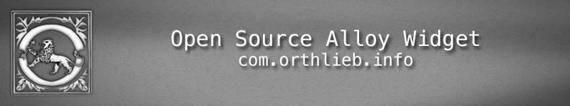
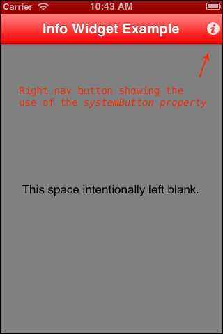
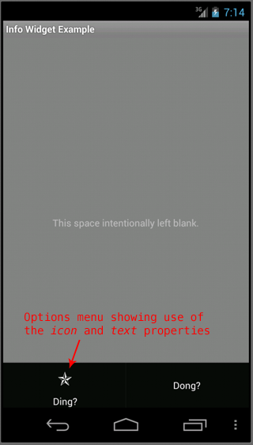
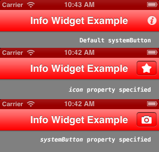

# Info Widget Sample

The **Info** widget provides a convenience abstraction for a [right navigation](http://docs.appcelerator.com/titanium/latest/#!/api/Titanium.UI.Window-property-rightNavButton) button on iOS and the [options menu](http://docs.appcelerator.com/titanium/latest/#!/api/Titanium.Android.Activity-property-onCreateOptionsMenu) on Android. You would use the Info widget to provide information on the current window or a currently selected item in your UI.




## Manifest
* Version: 1.0 (stable)
* Github: https://www.github.com/orthlieb/widget_info
* License: [Apache 2.0](http://www.apache.org/licenses/LICENSE-2.0.html)
* Author: Carl Orthlieb
* Supported Platforms: iOS (iPhone/iPad), Android

## Adding the Info Widget to Your Alloy Project

* In your application's config.json file you will want to include the following line in your dependencies:

```
"dependencies": {
    "com.orthlieb.info":"1.0"
}
```

*  Create a widgets directory in your app directory if it doesn't already exist.
*  Copy the widget_info/widgets/com.orthlieb.info folder into your app/widgets directory. 

### Support for the Android Action Bar
In Android 3.0 or greater, the info widget will use the Android Action Bar. To configure your application properly, you will have to add the following lines (or something very similar) to your tiapp.xml.

```
<android xmlns:android="http://schemas.android.com/apk/res/android"/>
	<tool-api-level>11</tool-api-level>
  	<manifest android:versionCode="1" android:versionName="1.2">
  		<uses-sdk android:targetSdkVersion="11"/>
	</manifest>
</android>
```
Please read the instructions to modify your TiApp.xml [here](http://docs.appcelerator.com/titanium/latest/#!/guide/Android_Action_Bar).

## Create an Info in the View
You can add a Info to a view by *requiring* the Info widget. 

	<Widget id="info" src="com.orthlieb.info"/>

Assign it an ID that you can use in your controller. E.g. `id="info"` You can now access the Info via `$.info` in your controller. 

## Styling the Widget
You can style any of the defined properties of the widget through the parent .tss file.

```
"#info": {
    systemButton: Ti.UI.iPhone.SystemButton.ACTION,
    icon: "images/star.png", 
    text: "Ding?"
}
```



## [Accessible Properties and Methods](id:propsandmethods)

### Properties

| Name | Type | Description | 
| ---- | ---- | ----------- |
| [systemButton] | *constant* | iOS only. Should be one of the defined types in [Ti.UI.iPhone.SystemButton](http://docs.appcelerator.com/titanium/latest/#!/api/Titanium.UI.iPhone.SystemButton). This property overrides the *icon* property (meaning that if you supply both, then *systemButton* takes precedence). Default if neither *systemButton* or *icon* are specified is [Ti.UI.iPhone.SystemButton.INFO_LIGHT](http://docs.appcelerator.com/titanium/latest/#!/api/Titanium.UI.iPhone.SystemButton).|
| [icon] | *string* | Background image for the button specified as a local file path or URL. If the icon is not specified then no icon appears on Android, just the text. On iOS, this property is overridden by the *systemButton* property (meaning that if you supply both, then *systemButton* takes precedence). | 
| [text] | *string* | Text to display in the options menu on Android. Default: "Info" |

Note that if you want to supply an icon you should supply it at a resolution appropriate to the resolution of the device.

| Platform | Resolution | Path | Size |
| -------- | ---------- | ------ | ---- |
| iOS | regular | app/assets/iphone/images/\<imagename\>.\<ext\> | 20 x 20 |
| iOS | retina | app/assets/iphone/images/\<imagename\>@2x.\<ext\>] | 40 x 40 |
| Android | low | app/assets/android/images/low/\<imagename\>.\<ext\> | 15 x 15 |
| Android | medium | app/assets/android/images/medium/\<imagename\>.\<ext\> | 20 x 20 |
| Android | high | app/assets/android/images/high/\<imagename\>.\<ext\> | 30 x 30 |
| Android | xdpi | app/assets/android/images/res-xdpi/\<imagename\>.\<ext\> | 40 x 40 |
 
You can use Photoshop or another image editing tool to accomplish this or use the handy [spork](https://github.com/appcelerator/spork) utility which will resize images for you automatically. 
 
### Methods

#### init(parentWindow)

Initializes the info button, attaching it to the parent window right nav button on iOS and inserting it into the options menu on Android.

| Parameter | Type | Description | 
| ---- | ---- | ----------- |
| parentWindow | *TiUIWindow* | Parent window to attach the info button to. |

For example:

```
$.info.init($.index);
```

## Future Work

* Support for other platforms like Mobile Web and Blackberry.


